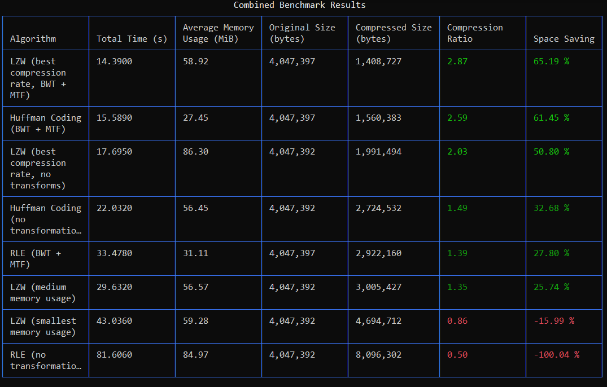

# Compress-py: A CLI tool for compressing files

---

## Description
This repository is a CLI tool for file compression, and offers an implementation for multiple famous algorithms such as
[Lempel-Ziv-Welch](https://en.wikipedia.org/wiki/Lempel%E2%80%93Ziv%E2%80%93Welch),
[Huffman coding](https://en.wikipedia.org/wiki/Huffman_coding), etc.

This project uses Python but refrains from any compression libraries. It uses the fantastic [Typer](https://typer.tiangolo.com/)
library for handling the CLI part.

## License
This project is licensed under the [GNU General Public License v3.0](LICENSE).


## Installation
### Python + Pip
Make sure you have both [Python](https://www.python.org/downloads/) and [pip](https://pip.pypa.io/en/stable/installation/) installed on your system.
  You can check if Python and pip are installed by running the following commands in your terminal:

```bash
python --version  # Check Python version
pip --version     # Check pip version
```

### Git
Next, clone the repository to your local machine using the command:
```bash
git clone https://github.com/Yair5675/compress-py
cd compress-py
```

### Virtual environment
This step is optional, but recommended in order to handle dependencies:
* For windows:
  ```bash
  python -m venv venv
  .\venv\Scripts\activate
  ```
* For Mac or Linux:
  ```bash
  python3 -m venv venv
  source venv/bin/activate
  ```

### Dependencies
Install the dependencies needed to start the project:
```bash
pip install -r requirements.txt
```

And that's it! You're ready to start using the program using the command:
```bash
python main.py [OPTIONS] COMMAND [ARGS]
```


## Compression and Decompression
As stated before, the project allows you to compress and decompress files using different algorithms.<br>
Although different algorithms may have different options, all of them share the following structure:

```
compress/decompress [ALGORITHM_NAME] [INPUT_FILE] [OUTPUT_FILE]
```

For example, if I wanted to compress a file using the [LZW](#lzw-lempel-ziv-welch) algorithm, I would write the
following command in the terminal:
```bash
python main.py compress lzw example.txt example.lzw
```

Moreover, compress-py does not allow compressing inplace, and will not go ahead as usual if the input file matches the 
output file.<br>

### Algorithm File Extensions
Notice the file extension '.lzw' in the example above. Each algorithm has its own custom extension that MUST be used
when compressing with it.<br>
This restriction was placed on purpose, to make sure the user remembers which algorithm was used to compress their files.

Here is a table mapping each algorithm with its file extension:

| Algorithm                                             | File Extension |
|-------------------------------------------------------|----------------|
| [Run-Length Encoding](#rle-run-length-encoding) (RLE) | .rle           |
| [Lempel-Ziv-Welch](#lzw-lempel-ziv-welch) (LZW)       | .lzw           |
| [Huffman Coding](#huffman-coding)                     | .huff          |


## RLE (Run-Length Encoding)
```bash
python main.py compress rle input.txt output.rle
```
[Run-Length Encoding](https://en.wikipedia.org/wiki/Run-length_encoding) is by far the simplest algorithm in this 
project (and arguably in the entire world). On its own it's not a good algorithm, so don't use it without
[transformations](#pre-compression-transformations) and expect good results.

### The idea
The basic premise is: You go over the data and for each character count how many times it is repeated (in a row). When 
you encounter a different character (or reached the end of the data), you output the number of times the character was
repeated, and the character itself.<br>
The decoding phase is very easy as one can imagine, simply read the count and repeat the characters.

### Notes about my implementation
My implementation slightly differs from what I've described above. Instead of iterating over characters (or bytes) in
the data, I iterate over singular BITS. The simple reason is that when applying 
[pre-compression transformations](#pre-compression-transformations) to the data, iterating over bits performs better 
than iterating over bytes.<br>

My RLE compressor uses 'RLE Blocks'. Each block is just 4 bits - the first bit is the input bit (i.e, the bit we want
to compress). The second, third, and fourth bits hold the number of times the bit was repeated, which means we can 
record up to 8 repetitions.
You might think "But wait, 3 bits can only represent 0 through 7, how come you say 8?". Well, you're right, but notice
that we don't need to represent "0 repetitions", so if those 3 bits represent the repetitions MINUS 1, we get a bonus
repetition for free!

Sometimes the total size of all blocks will not be divisible by 8, which is a problem since files work with bytes.
Counter this issue, another byte is added to the start of the data, specifying how many bits were added as padding to
the end of the data, which helps the decompression step avoid adding false data when it encounters these padded bits.


## LZW (Lempel-Ziv-Welch)
```bash
python main.py compress lzw input.txt output.lzw
```

[LZW](https://en.wikipedia.org/wiki/Lempel%E2%80%93Ziv%E2%80%93Welch) is a relatively simple yet very efficient 
compression algorithm. It is a dictionary based compression algorithm, however the dictionary is built throughout the
compression and decompression phases, therefor it does not need to be transferred within the compressed data itself.

### The idea
The algorithm starts with a dictionary that maps each byte value to itself. It then looks at progressively longer and 
longer substrings in the data, and once such substring is found which isn't registered in the dictionary, an index is
assigned to it. If this substring occurs again, the previously mentioned index is outputted instead of the entire
substring.

The decoding phase is very similar. It also starts with a simple dictionary containing byte values mappings, and as it 
receives the encoded indices from the compressed file, it expands its dictionary just like the compression phase.

The algorithm ensures that the dictionary formed during compression can be rebuilt during decompression without sending 
it in the compressed data, which saves a lot of space.


### Memory limitations
As described previously, the LZW algorithm creates more and more indices to better compress files. This, however, can 
introduce memory issues.  Most users wouldn't like it very much if the algorithm utilized an extremely large portion of
their RAM while compressing a particularly stubborn file.

For this reason, users can limit the memory usage of the algorithm using two different values:

#### Dictionary Size
Controls the maximum number of entries that can be created during compression.<br>The user can 
choose from the following options:<br>
* **Small** - Allow up to `1,000` entries.
* **Medium (Default)** - Allow up to `10,000` entries.
* **Large** - Allow up to `100,000` entries.
* **Extra Large** - Allow up to `1,000,000` entries.
* **Custom** - Choose the value you want to limit the algorithm to (Must be above 0).

It should be noted that although limiting entries improves memory usage, it hurts compression efficiency, as larger 
patterns in the data may not be indexed.

#### Out of Memory Strategy
When limiting the size of our dictionary, we must decide on a strategy in case we exceed our limitations.

My project offers the following:
* **Abort (Default)** - Simply abort the compression. Useful when memory is a critical issue.

* **Stop Store** - Stops the creation of new indices. The compression will rely entirely upon previously indexed 
substrings. While this ensures the number of entries is less than or equal to the configured amount, it hurts 
compression efficiency.<br>
This option is best suited for situations where memory should be carefully monitored, however compression must occur.
* **Use Minimum Required** - Disregards any memory limitations, and simply creates new indices if it needs to. When this
strategy is selected, previously given dictionary size is meaningless.<br>
It is best used in situations where compression efficiency is given a priority over memory usage.

### Notes about my implementation
While the dictionary is not sent via the compressed data and can be reconstructed during decompression, the implementor
of the algorithm must think of a way to differentiate between the different indices during decompression.

One such way is to decide on a constant length for every index, however this wastes space for small indices (which occur
frequently at the beginning of the compression process, and in case the data contains little repetitions).

Instead, I used variable-length indices. To implement it, I insert a single byte before each index, whose value is the 
number of bytes needed to represent the index.

For example, the index 243 would only require 1 byte, however 256 would require two.


## Huffman Coding
```bash
python main.py compress huffman input.txt output.huff
```

[Huffman Coding](https://en.wikipedia.org/wiki/Huffman_coding) is a widely known and extremely popular compression 
algorithm. Similarly to LZW, it is a dictionary based algorithm, however it does require the dictionary to be 
transferred via the compressed data.<br>
While this may deter you from choosing it over LZW, it more than compensates for it, as it usually achieves better 
results than LZW compression.

### The idea
Since we are encoding byte values, each of them (uncompressed) is represented with a number in the range [0, 256). 
However, some values appear more frequently than others, therefor we could compress the file if we assigned shorter
codes to values who appear more in the data.

#### Huffman tree
One thing about the shortened codes - a code associated with a value cannot be the prefix of another code. This 
ensures that once we replace the original value with its code, the decoding step will easily distinguish it from other 
codes.

To implement that, we create a Huffman tree. We first count all occurrences of each value, and sort them based from 
rarest to most common. Then, we follow the following algorithm:

```
While length(nodes_list) >= 2:
  - Take the two nodes out of the list
  - Create a parent node for them, whose frequency value will be their frequencies' sum
  - Insert the parent node into the list and resort it
```

You might think "Ok, we built a tree, but how does it help us?". Well, we can now create the shortened codes, based on
the tree's structure!

We can treat going to the left node as adding a 0 bit to the code, and going to the right as adding 1 bit to the code.
Since the rarest values are added first in our algorithm, they will be at the bottom of the tree with the longest codes.
However, more common values will be at the very top, which will result in them having short codes.

#### Using the encodings
After forming the tree and extracting the shortened codes for each byte value (from now on referred to as "the 
encodings"), we simply iterate over every byte value in the input and replace it with its encoding.<br>
Lastly, we just somehow compress the Huffman tree or the encodings themselves, and write them along with the compressed 
data.

Decoding is fairly simple: Just reconstruct the encodings from the file, and replace the rest of the data in the file 
(which is compressed) with its original values, according to the reconstructed


### Notes about my implementation
The keen reader might notice I left the method of encoding the Huffman tree vague. This was done intentionally, as there
are many ways to do so.<br>
My implementation is the following:

1) Encode the number of leaves minus 1 as the first byte. Since there could be at most 256 leaves (each leaf is a byte
value), and there can never be 0 leaves, we can fit this information into a single byte, provided we decrement the count
by 1.<br>
You might wonder why would we do this? Well, it would be helpful in the decoding step, as malformed data will be 
detected (imagine our decoding step finds more leaves than needed or fewer leaves than needed).

2) Go over the tree in **preorder** traversal (root, left, right). For each node record the following:
    - The node's value: Write the byte value held in the node only if it's a leaf node (otherwise write 0). Use 8 bits
   for this value.
    - The node's left child: Write 1 if the node has a left child, 0 otherwise.
    - The node's right child: Write 1 if the node has a right child, 0 otherwise.

And that's it! That's all the information we need to fully reconstruct the tree.

Normally, only recording the preorder traversal of a binary tree wouldn't be enough to uniquely reconstruct it, however
the added two bits per node that inform us of its children provide us with the necessary info, while requiring less 
space than recording the tree's values again in another traversal.

As for decoding, I'll leave the algorithm as an exercise for the reader. If you want to see the solution (or more 
accurately, my solution), go to `compressors\huffman\tree.py`, and look for the `__form_root_node` method.


## Pre-Compression Transformations
Aside from compression algorithms, compress-py offers another way to increase compression ratios: Pre-Compression
Transformations.<br>
These algorithms do not compress the data they receive, but instead change its order or replace it values. The resulting
data is compressed by the algorithms much more efficiently, and almost always achieves better results than the original
data (if you don't believe me, compare compression ratios on different files using the 
[compare-all](#the-compare-all-command) command).

When compressing a file, add transformations in the following way:
```bash
python main.py compress/decompress [ALGORITHM_NAME] [INPUT_FILE] [OUTPUT_FILE] -t [FIRST_TRANSFORM] -t [SECOND_TRANSFORM]
```
The transformations will be applied to the data according to the order you provide. For example, if I called:
```bash
python main.py compress huffman file.txt file.huff -t BWT -t MTF
```
The content of `file.txt` would be transformed by the [Burrows Wheeler Transform](#the-burrows-wheeler-transform), its
output transformed by the [MTF Transform](#move-to-front-transform), and finally ITS output will be compressed.<br>
Obviously, transformations will need to decompress the data in reverse order. However, when decompressing, **specify
transformation in the same order specified in the compression stage**. If we want to decompress the example above we'll
call:

```bash
python main.py decompress huffman file.huff file.txt -t BWT -t MTF
```
The program will handle reversing the order.

**My Recommendation**: I recommend always specifying [BWT](#the-burrows-wheeler-transform) followed by 
[MTF](#move-to-front-transform). This combination almost always guarantee better compression ratios. However, if you
know the input file already contains many repeating values in a row, calling BWT is not necessary and MTF will work well
on its own.

### The Burrows-Wheeler Transform
The [Burrows-Wheeler transform](https://en.wikipedia.org/wiki/Burrows%E2%80%93Wheeler_transform) is an algorithm used to
rearrange the input data such that similar values will be placed close together, which increases compression efficiency
for most algorithms. It does so by sorting all circular shifts of the input data according to lexicographical order, and then taking the last
character of each shift (if you're curious about how and why it groups similar characters together, research the topic!).

Due to [reasons I will explain later](#output-data-layout), my implementation supports files whose size is smaller than
**2<sup>2040</sup>** bytes, which is **2<sup>2010</sup> Gigabytes**. None of you would ever have a file this large, but
if you read this file 100 years into the future and somehow have such a file, be careful of this limit.

<sub>(but seriously this size limit is so gigantic I can safely say it won't be a problem for any use-case)</sub>

### My implementation
#### BWT Construction
Although the idea described above requires sorting all cyclic shifts of the input data, this approach is very 
inefficient, so much so it would be impractical beyond a certain file size.

Luckily, it's not the only option. The BWT of some data can be calculated through **a
[sorted suffix array](https://en.wikipedia.org/wiki/Suffix_array) of the data**, which can be done efficiently at O(n).

The algorithm that creates this suffix array is called **"Suffix Array - Induced Sorting"** (or SA-IS), and it is the
one I chose to implement.<br>
In my implementation I followed [this wonderful guide](https://zork.net/~st/jottings/sais.html). I highly encourage 
anyone interested to check it out, as it is the best explanation of the SA-IS algorithm out there.

Another thing to note aside from the suffix array construction is the EOF used in the transformation. When calculating
the inverse of the transformation, an EOF needs to be placed to correctly reconstruct the original input.<br>
In my implementation, this EOF isn't inserted directly, but instead its location in the BWT is saved in the metadata
attached to the transformation.

The reason for that decision is that finding a byte value that doesn't appear in the data is highly unlikely, making EOF
treatment cumbersome and complex. Saving the index where the EOF would be placed is much easier (see
[output data layout](#output-data-layout) if you're curious as to how I did it).


#### Output data layout
Some metadata is necessary to tell the decompressor where an EOF byte would have existed had it been encoded. A 
delimiter separating between the EOF index and the actual BWT has to be found.

Here is my implementation for finding such delimiter:

1) Assume the index is smaller than $2^{8 * 255}$ ($2^{2040}$). This means that we will need at most 255
    bytes to represent it.
2) If the index only has 255 bytes, there is guaranteed to be at least one byte value __not used__ by the index (as 
   there are 256 possible values, and at most 255 are used).
3) Find this missing value (exercise for the reader - do this with O(1) space complexity, meaning no lists or sets, 
   even if technically there could be at most 256 values. Answer's in `transformations\bwt.py\find_missing_byte_val` 
   function). This value will be the delimiter that separate the EOF index and the actual data, to avoid confusion while
   decompressing.

After choosing the delimiter as described above, the complete output data will be:

`Delimiter (full byte), EOF index in the BWT (at most 255 bytes), Delimiter (full byte), The actual BWT 
(unknown length)`

The delimiter appears at the first byte to let the decompression stage know what the compressor chose as a delimiter.
Then come the EOF index's bytes, followed by the delimiter again to signal the decompressor when the index ends. From
this point on the actual BWT is added.

The metadata added to the BWT is minimal, and in mathematical terms if the size of the BWT is N bytes, the size of the
metadata in bytes would be $2 + \lceil \frac{1}{8} * log_2(N) \rceil$. With that being said, due to our assumption that
$N < 2^{2040}$, the maximum length of the metadata is 257 bytes, so I consider it to be O(1).


### Move-To-Front Transform
The [Move-To-Front transform](https://en.wikipedia.org/wiki/Move-to-front_transform) is a pre-processing transformation
that aims to replace long runs of identical bytes with 0 bytes, which proves to be helpful for many compression 
algorithms.

MTF initializes an alphabet, in my implementation this is just all the possible byte values, and treats it as a stack
where the index of a byte value in the stack indicates how recently it was used.<br>
After this initialization, it does something like this:

```
For every byte 'b' in data do:
    i := index of 'b' in stack
    output i
    move 'b' to the top of the stack
```

This results in frequently used byte values receiving small encodings, oftentimes zeroes and ones, which can later be
compressed efficiently.

**Note about my implementation:** Implementations of MTF generally fall into either the 'array' category or the 
'linked list' category. I used a linked list, but there is no clear advantage to either side.

## Compression Statistics
Compress-py allows its users to receive information about the compressions taking place:

### The Benchmark Option
When compressing and decompressing files using any algorithm, the benchmark option can be activated:
```bash
# Long name:
python main.py compress <algorithm_name> <input_file> <output_file> --benchmark
# Short name:
python main.pt compress <algorithm_name> <input_file> <output_file> -b
```

Choosing this option will compress/decompress your file as usual, but will also print a table with important information
about the action.

__For Compression:__

| Total Time (s)                               | Memory Usage (MiB)                                                                                           | Original Size (bytes)                             | Compressed Size (bytes)                          | [Compression Ratio](https://en.wikipedia.org/wiki/Data_compression_ratio)                                                               | Space Saving                                                          |
|----------------------------------------------|--------------------------------------------------------------------------------------------------------------|---------------------------------------------------|--------------------------------------------------|-----------------------------------------------------------------------------------------------------------------------------------------|-----------------------------------------------------------------------|
| Time it took for the compression to complete | Information about the memory usage of the program, specifically its lowest, average and maximum memory usage | The size of the file before compression, in bytes | The size of the file after compression, in bytes | One way to measure compression efficiency.<br/>Basically the ratio between the lengths of the uncompressed data and the compressed data | Percentage of the reduction in size relative to the uncompressed file |

__For Decompression:__
Only "Total Time" and "Memory Usage" are given.

#### Example


### The 'compare-all' command
Not sure which algorithm to pick when compressing a file? We got you covered! The `compare-all` command allows you to
test every single algorithm on a file, without the result being saved to tons of output files.<br>
The command also uses different configurations and transformations to save you the headache.

The syntax for the compare-all command is the following:
```bash
python main.py compare-all INPUT_PATH
```

After running the command, the following information will be printed to the screen:

| Algorithm                 | Total Time (s)                                            | Average Memory Usage (MiB)                             | Original Size (bytes)                             | Compressed Size (bytes)                          | [Compression Ratio](https://en.wikipedia.org/wiki/Data_compression_ratio)                            | Space Saving                                                                |
|---------------------------|-----------------------------------------------------------|--------------------------------------------------------|---------------------------------------------------|--------------------------------------------------|------------------------------------------------------------------------------------------------------|-----------------------------------------------------------------------------|
| The name of the algorithm | The time it took the algorithm to compress the given file | Average memory usage of the program during compression | The size of the file before compression, in bytes | The size of the file after compression, in bytes | The ratio between the lengths of the uncompressed input file and the result of the current algorithm | Percentage of the reduction in size relative to the uncompressed input file |

The algorithms in the table will be sorted according to their resulting compression ratio, from best to worst, and will
be colored accordingly.

#### Example

